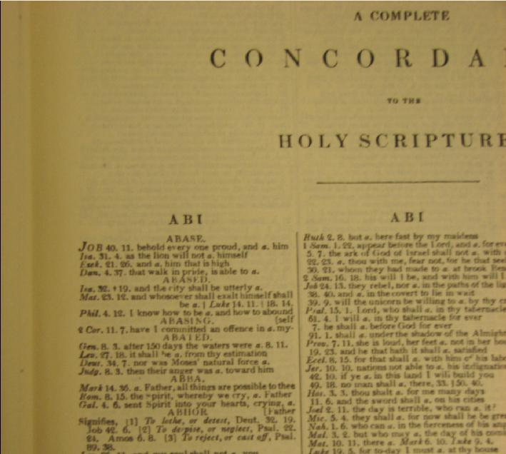
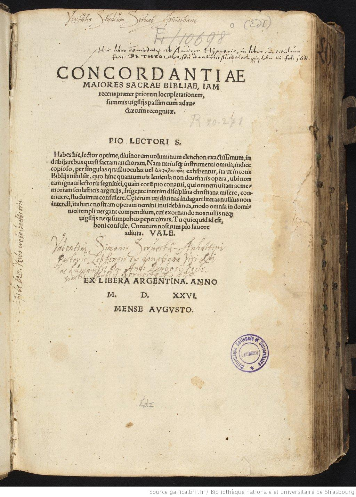
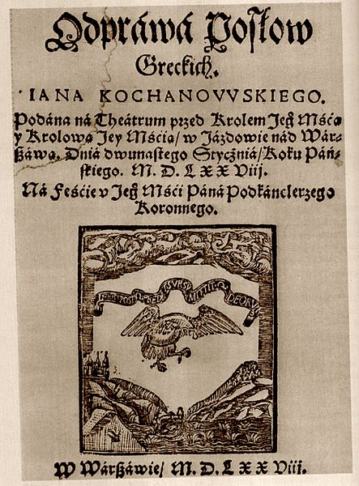

## topics covered today

- Digital Humanities
- Text analysis
- Data
- (Open) Science


# Digital Humanities


## what is Digital Humanities?

get a randomly drawn definition: [https://whatisdigitalhumanities.com/](https://whatisdigitalhumanities.com/)


## Digital Humanities

- library catalogs
- virtual collections
- text analysis
- vision
- folklore studies
- linguistics
- computational literary studies
- ...


## DH emerges

- early journals
    - _Computers and the Humanities_ (1966--2004)
    - _Literary and Linguistic Computing_ (1986--2014)
    - cont. as _Digital Scholarship in the Humanities_ (2015--)
- conferences
    - ALLC/ACH conference (1989--2005)
    - cont. as "Digital Humanities" conference (2006--)
- summer schools
    - Humanities Computing Summer Institute ...
    - ... cont. as Digital Humanities Summer Institute
- textbook _Companion to Digital Humanities_ (2004)


## DH as a big tent

- collecting the data
    - libraries
    - text collections
    - Text Encoding Initiative
- data analysis
    - statistical modeling
    - distant reading
- data curation
- data visualization
- programming
- critical DH


## a few examples

The following is just a small selection of DH projects:

- [Women Writers Project](https://cssh.northeastern.edu/nulab/wwp/)
- [The Devonshire Manuscript](https://en.wikibooks.org/wiki/The_Devonshire_Manuscript)
- [Archaeology of Reading](https://archaeologyofreading.org/)
- [Reframing the Lagoon City as an Archipelago](https://veniss.eu/)
- [US Presidential Elections](https://dsl.richmond.edu/panorama/electingthepresident)
- [Mapping Textual Similarities](https://computationalstylistics.github.io/projects/bootstrap-networks/)


# Text Analysis


## concordances, attributions, ...

- abbot Hugo de Saint-Cher: first concordance (ca 1230)
- Lorenzo Valla: authorship attribution of _The Donation of Constantine_
- Erasmus Roterodamus: attribution of St. Paul's and Seneca's letters
- Roberto Busa: _Index Tomisticus_ (1949--1970)


## concordance to _King James Bible_ (1737)




## Biblical concordance (1526)




## computers and the humanities?

- the Enigma and code-breaking (Rejewski, Zygalski, Różycki)
- Alan Turing
- first computers suitable to count numbers only
- IBM and a Jesuit monk Roberto Busa (late 1940s)


## father Roberto Busa (1913--2011)


## the internet vs. text collections


- page images (no access to the text)
- raw text (no formatting)
- enriched corpora (containing information about structure and/or syntax)


## WBC and similar sources




## small & tidy vs. big & dirty

- Optical character recognition (OCR): an easy way to convert image into text
- However, a considerable number of mistakes might occur
- Vast majority of corpora are OCR-ed and (sometimes) corrected
- Gutenberg Project, Wikisources, etc. etc. etc.


## PoS tagging: grammatical labels

My father was a clergyman.

👇


👇

PRP$ NN VBD DT NN

(poss. pron.) (noun) (verb) (determiner) (noun)


## Part-of-Speech tagging


| My   | father | was  | a  | clergyman | . |
|------|--------|------|----|-----------|---|
| PRP$ |   NN   |  VBD | DT |   NN |  . | 
| (poss. pron.) | (noun) | (verb) | (determiner) | (noun) | (punct.) |


## Stanford Tagger

``` txt
This     DT
is       VBZ
a        DT
short    JJ
sentence NN
.        .

So       RB
is       VBZ
this     DT
.        .
```


## Structured output

``` xml
<sentence id="0">
  <word wid="0" pos="DT">This</word>
  <word wid="1" pos="VBZ">is</word>
  <word wid="2" pos="DT">a</word>
  <word wid="3" pos="JJ">short</word>
  <word wid="4" pos="NN">sentence</word>
  <word wid="5" pos=".">.</word>
</sentence>
<sentence id="1">
  <word wid="0" pos="RB">So</word>
  <word wid="1" pos="VBZ">is</word>
  <word wid="2" pos="DT">this</word>
  <word wid="3" pos=".">.</word>
</sentence>
```


# Data


## data as representation 

- sample vs. population
- operationalizing and acquisition
- the biggest corpus is still small
    - under-resourced languages


## data: biases 

- opportunistic sampling
- cherry picking
- biases (gender, race, culture traits, ...)
    - e.g. COHA, COCA
- uneven coverage
    - diachronic corpora


## data: quality

- small & tidy vs. big & dirty
- poor OCR might affect the quality
- other factors are also there


## data: a model

Data is never a "neutral" material to conduct further modeling. Data is already a model, and it hightly depends on (tacit) assumptions and arbitrary decisions.

- POS-tagging inherits the grammar on which the tagger was trained
- TEI is always modeled as a tree
- annotation as an arbitrary decision:
    - should a general sctructure be annotated?
    - should the annotation focus on minor elements?
    - etc.


## example: structural annotation

``` xml
<body>
    <div type="act" n="1">
    <head rend="caps">Primera Jornada</head>
        <div type="scene" resp="#rojas" n="1">
        <stage type="withText">Salen por una puerta, habiendo tocado cajas y trompetas, Jonatás, Simeón y Judas, y por otra Matatías, viejo, Zarés y músicos.</stage>
            <sp who="#música">
            <speaker rend="caps">Músicos</speaker>
                <l>Cuando alegre viene</l>
                <l>Judas vencedor,</l>
                <l>su frente coronan</l>
                <l>los rayos del sol.</l>
            </sp>
            <sp who="#matatías">
            <speaker rend="caps">Matatías</speaker>
                <l>Valerosos Macabeos,</l>
                <l>legítima sucesión</l>
                <l>de Palestina; hebreos,</l>
                <l>cuya gloriosa opinión</l>
                <l>vence al tiempo en los trofeos,</l>
                <l>triunfad dichosos; y vos,</l>
                <l>Judas valiente, a quien Dios</l>
```

## example: linguistic annotation

``` xml
            <seg xml:id="morph_1.2-seg" corresp="ann_segmentation.xml#segm_1.2-seg">
              <fs type="morph">
                <f name="orth">
                  <string>tej</string>
                </f>
                <f name="translit">
                  <string>tey</string>
                </f>
                <f name="interps">
                  <fs xml:id="morph_1.2.1-lex" type="lex">
                    <f name="base">
                      <string>ten</string>
                    </f>
                    <f name="ctag">
                      <symbol value="adj"/>
                    </f>
                    <f name="msd">
                      <vAlt>
                        <symbol xml:id="morph_1.2.1.1-msd" value="sg:dat:f:pos"/>
                        <symbol xml:id="morph_1.2.1.2-msd" value="sg:gen:f:pos"/>
                        <symbol xml:id="morph_1.2.1.3-msd" value="sg:loc:f:pos"/>
                      </vAlt>
                    </f>
                  </fs>
                </f>
                <f name="disamb">
                  <fs type="tool_report">
                    <f fVal="#morph_1.2.1.3-msd" name="choice"/>
                    <f name="interpretation">
                      <string>ten:adj:sg:loc:f:pos</string>
                    </f>
                  </fs>
                </f>
              </fs>
            </seg>

```


## data: capta?

> Capta is “taken” actively while data is assumed to be a “given” able to be recorded and observed. From this distinction, a world of differences arises. Humanistic inquiry acknowledges the situated, partial, and constitutive character of knowledge production, the recognition that knowledge is constructed, taken, not simply given as a natural representation of pre-existing fact.

(Drucker, 2011: 11)


## further reading

- Arnold, T. and Tilton, L. (2015). _Humanities Data in R: Exploring Networks, Geospatial Data, Images, and Text_. New York: Springer.
- Crawford, K. (2021). _Atlas of AI: Power, Politics, and the Planetary Costs of Artificial Intelligence_. Yale University Press. 
- Drucker, J. (2011). Humanities Approaches to Graphical Display, _Digital Humanities Quarterly_, 5(1). url: [https://dhq.digitalhumanities.org/vol/5/1/000091/000091.html](https://dhq.digitalhumanities.org/vol/5/1/000091/000091.html).
- Flanders, J. and Jannidis, F. (2019). _The Shape of Data in Digital Humanities: Modeling Texts and Text-based Resources_. Routledge.

## further reading (cont.)

- Karsdorp, F., Kestemont, M., & Riddell, A. (2021). _Humanities Data Analysis: Case Studies with Python_. Princeton University Press. 
- Schriebman, S., Siemens, R., and Unsworth, J. (2004) _A Companion to Digital Humanities_. Oxford: Blackwell. url: [https://companions.digitalhumanities.org/DH/](https://companions.digitalhumanities.org/DH/).


