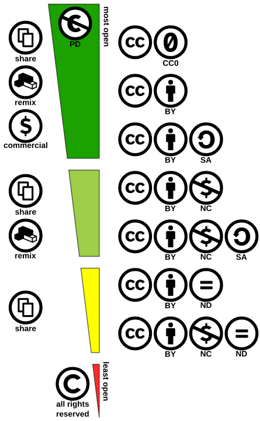

## topics covered today


- reproducibility
- Open Science
- FAIR principle


# (Data) Science

## scientific method

- possible to falsify
- hypothesis-driven
- statistical inference
- reproducibility


## p-value religion

> The [number of standard deviations] for which P = .05, or 1 in 20, is 1.96 or nearly 2; it is convenient to take this point as a limit in judging whether a deviation is to be considered significant or not.
(Roland Fisher)

Most people don’t think of convenience as a serious criterion. Later in his career, Fisher actively advised against always using the same threshold for significance.


## p-value hacking


## 


## reproducibility crisis

- data not available
- results difficult to verify
- the procedures vague
- ... and not clearly explained


# Open Science

## open science commitment

- preprints online: [arXiv.org](https://arxiv.org/)
- data and code available: [GitHub](https://github.com/)
    - e.g. [computationalstylistics repositories](https://github.com/computationalstylistics/)
- materials with DOI, e.g. on [Zenodo](https://zenodo.org/)
- reproducible writing/coding
    - jupiter notebooks
    - RStudio
    - quarto
    - markdown


## FAIR principle

- Findability
    - each deposited file is described with rich metadata
    - the access is open and free
- Accessibility
    - metadata are accessible via open standards and protocols
    - metadata are accessible via open APIs
- Interoperability
    - use of commonly accepted file formats
    - use of identifiers: DOI, PMID, SWHid, arxivid
- Reusability
    - general terms of use, e.g. CC0 license


## restrictive vs. permissive licenses

- Copyright -- all rights reserved
    - applicable up to 70 years after the author's death
- Public Domain -- use freely
    - expired Copyright automatically becomes Public Domain
- Creative Commons -- some rights reserved 👈
    - different variants of the license
    - the author can choose: CC BY, CC0, etc.
- General Public License -- open source code
    - the code can be copied, but needs to be released under GPL
    - see also: Apache License, BSD License, MIT License, etc.


##




## reproducible datasets

- [European Literary Text Collection (ELTeC)](https://www.distant-reading.net/eltec/)
- [Drama Corpora Project (DraCor)](https://dracor.org/)
    - the notion of Programmable Corpora


# markdown


## markdown

- lightweight markup language
- commonly used in blogs, documentation etc.
- gaining popularity in Open Science setups
- available in different flavors ...
- ... but core conventions are universal

## markdown: example 1

``` txt
use double asterisks to indicate **bold font**
use underscores to get _italics_
for monospaced font, use `back apostrophes`
also, use the tilde to ~strikethrough~ 
> block quotations should begin with the '>' sign at the beginning of the line; the quotation itself can be actually quite long
```

use double asterisks to indicate **bold font**

use underscores to get _italics_

for monospaced font, use `back apostrophes`

also, use the tilde to ~strikethrough~ 

> block quotations should begin with the '>' sign at the beginning of the line; the quotation itself can be actually quite long


## markdown: example 2

``` txt
# Heading 1 

## Heading 2 

This is the heading level used in the titles of these slides

### Heading 3

#### Heading 4

##### Heading 5

You get the point: the nested headings are marked with '#' characters

```

### Heading 3

#### Heading 4

##### Heading 5

You get the point: the nested headings are marked with '#' characters


## markdown: example 3

``` txt
- first item
    - it can be nested, of course
- second item
    - a subitem
        - a nested subitem
- third item
    1. numbered list?
    2. no problem

```

- first item
    - it can be nested, of course
- second item
    - a subitem
        - a nested subitem
- third item
    1. numbered list?
    2. no problem


## markdown: example 4

That's how links should be styled:

``` txt
[Link](http://a.com)
```

and this is how images are included:

``` txt


```


## markdown resources


- learn markdown in 60 seconds: [tutorial](https://commonmark.org/help/)
- a simple markdown editor to play with your coding: [markup.rocks](https://markup.rocks/)
- a more advanced online tool to work collaboratively using markdown: [hackMD](https://hackmd.io/)
- source file of the [current slideshow](https://raw.githubusercontent.com/computationalstylistics/HVEE.00.016/refs/heads/main/slides_2_Open_Science/index.md)


# versioning & git repos


## Git

- distributed version control software system
- capable of managing versions of source code or data
- often used to control source code in collaborative setups
- used either in commandline mode, or via graphic interfaces
- e.g., here's a simple commandline interaction:

``` txt
git status   # this shows which files were changed
git add *    # this stashes all the changed files
git commit   # this freezes the files, and creates a new 'snapshot'
git push     # and finally, this sends the files to the repository
```

##


## GitHub and GitLab: repositories

- GitHub repository of [this very course HVEE.00.016](https://github.com/computationalstylistics/HVEE.00.016/)
- general [GitHub](https://github.com/)
- [GitLab server](https://hpc.ut.ee/services/other-services/Gitlab) run by the University of Tartu
- general [GitLab](https://gitlab.com/)


